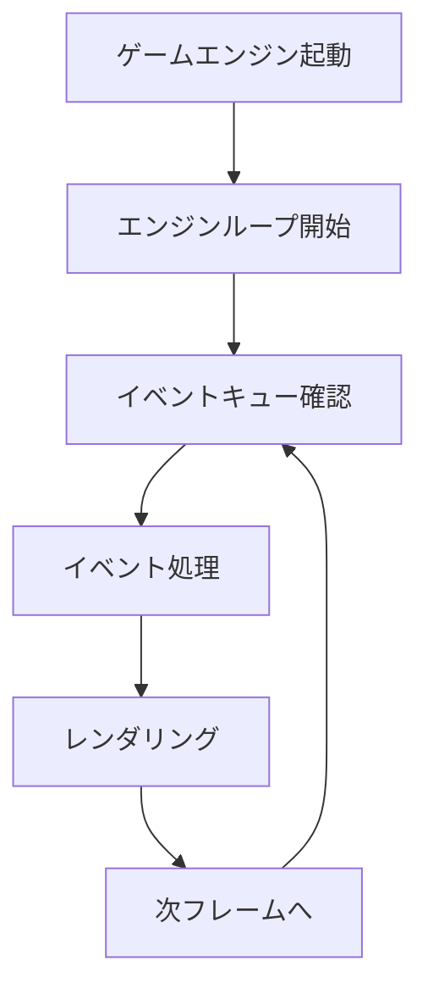

# SL-GEM アーキテクチャ設計書

## システムアーキテクチャ
```mermaid
graph TD
    A[SL-GEM モノレポ]
    A --> B[ゲームエンジン/モデル]
    A --> C[データエディタ (Tauri)]
    A --> D[ゲーム実装]
    
    %% ゲームエンジン/モデル内部 (modelは共通ライブラリとして利用)
    B --> B1[戦略エンジン]
    B1 --> B11[MapGUI]
    B1 --> B12[拠点GUI]
    B1 → B13[勢力GUI]
    B1 → B14[ターンシステム]
    B1 → B15[敵勢力のCPU]
    
    B → B2[戦闘エンジン]
    B2 → B21[戦場Map]
    B2 → B22[戦闘GUI]
    B2 → B23[ユニット操作]
    B2 → B24[接触で戦闘]
```

## エンジン基盤設計


### イベントシステム
- Pub/Subパターンを採用
- イベントバス経由で非同期にイベントをやり取り
- パブリッシャー：各種ゲームコンポーネント（Map、GUI、AI等）
- サブスクライバー：イベントに関心のあるコンポーネント
- イベントキューで時系列管理

## ディレクトリ構成
```plaintext
sl-gem/             <- モノレポのルート
├── engine/         <- ゲームエンジン用サブプロジェクト
│   ├── Cargo.toml
│   └── src/
│       ├── core/
│       │   └── engine.rs
│       ├── strategy/
│       │   ├── map.rs
│       │   ├── faction.rs
│       │   └── ai.rs
│       ├── gui/
│       │   ├── map_view.rs
│       │   └── base_view.rs
│       └── main.rs
├── model/          <- ゲームモデル共通ライブラリ
│   ├── Cargo.toml
│   └── src/
│       └── lib.rs
├── game/           <- ゲーム実装
│   ├── Cargo.toml
│   └── src/
│       └── main.rs
└── data-editor/    <- データエディタ (Tauri)
    ├── tauri.conf.json
    ├── package.json
    └── src/
        └── main.js or main.ts (利用するフレームワークに依存)
```

## 技術選定
- **ゲームエンジン/モデル**
  - Rust、共通ライブラリとしてモデルを独立
  - GUI: Egui および WGPU の活用を検討
  - データ管理: Serde, RON
- **データエディタ**
  - Tauri
  - フロントエンドフレームワーク (React, Vue, Svelte など)