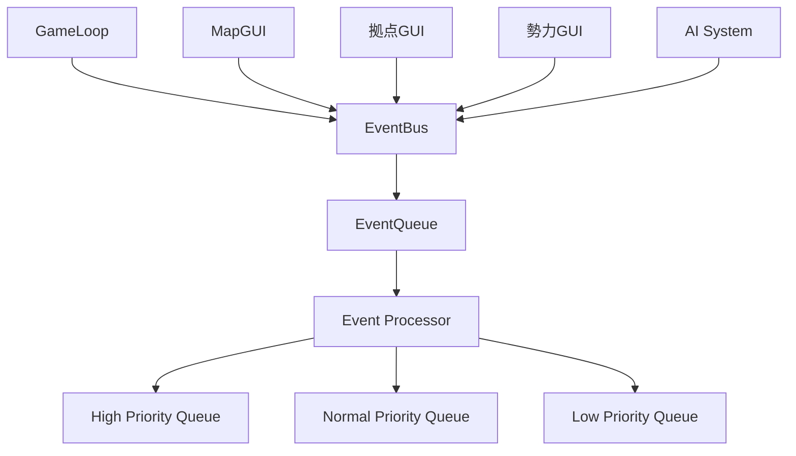
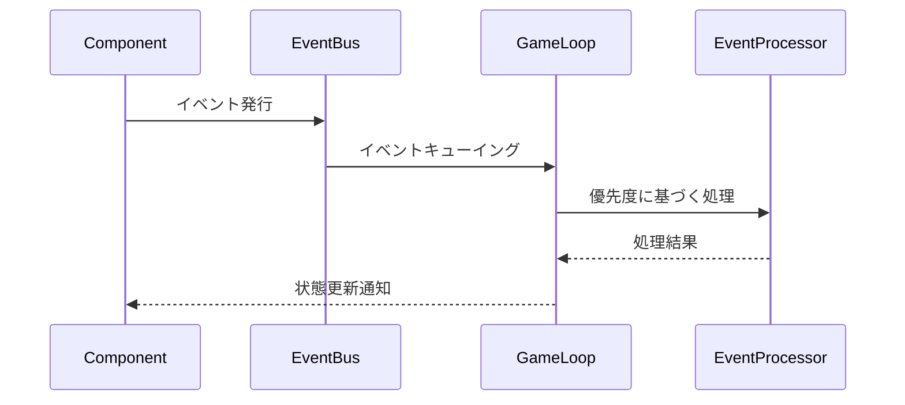
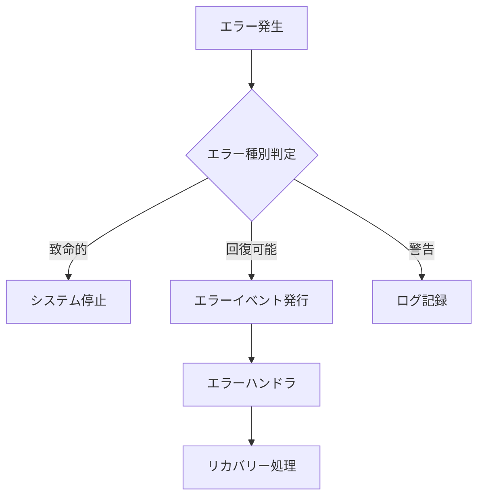

# イベントキューを用いたメインループ設計

## 概要
ターン制ウォーSLGゲームのためのイベントドリブンなメインループシステム。コンポーネント間の疎結合性を保ちながら、予測可能で安定した動作を実現します。

## アーキテクチャ


## イベントシステム詳細

### 1. イベントの優先度
- **High Priority**
  - システムイベント（Start, Stop, Pause）
  - エラー関連イベント
  - ユーザー入力イベント
- **Normal Priority**
  - ゲーム状態更新イベント
  - AI行動イベント
  - アニメーション制御イベント
- **Low Priority**
  - ログ記録イベント
  - 統計更新イベント
  - デバッグ情報イベント

### 2. イベントフロー制御


### 3. イベント定義
```rust
pub enum GameEvent {
    // システムイベント（High Priority）
    Start,
    Stop,
    Pause,
    Resume,
    
    // ゲーム状態イベント（Normal Priority）
    Update { delta: f32 },
    TurnStart { faction_id: u32 },
    TurnEnd { faction_id: u32 },
    UnitMove { unit_id: u32, position: Position },
    
    // 情報イベント（Low Priority）
    Log { message: String, level: LogLevel },
    Stats { metric: String, value: f64 },
}
```

## エラー処理戦略

### 1. エラーの種類
- **致命的エラー**: システムの即時停止が必要
- **回復可能エラー**: 特定のアクションの失敗
- **警告**: 正常動作に影響しない問題

### 2. エラーハンドリング


## デバッグとモニタリング

1. **イベントログ**
   - 全イベントの時系列記録
   - イベント処理時間の測定
   - イベントキューのサイズモニタリング

2. **パフォーマンスメトリクス**
   - フレームレート
   - イベント処理レイテンシ
   - メモリ使用状況

## 拡張性

### 1. 新規イベント追加手順
1. GameEvent列挙型に新しいバリアントを追加
2. イベントの優先度を定義
3. 対応するハンドラを実装
4. 必要に応じてテストを追加

### 2. コンポーネント連携
- イベントバスを介した疎結合な通信
- 型安全なイベントハンドリング
- コンポーネントのライフサイクル管理

## 実装ガイドライン
1. イベントは不変（immutable）であるべき
2. イベントハンドラは副作用を最小限に
3. エラー処理は常に考慮する
4. デッドロックを防ぐため長時間の処理は避ける
5. イベントの循環参照を防ぐ設計を心がける

## テスト戦略
1. ユニットテスト：個々のイベント処理
2. 統合テスト：イベントフローの検証
3. 負荷テスト：高負荷時の動作確認
4. エラー処理テスト：異常系の確認