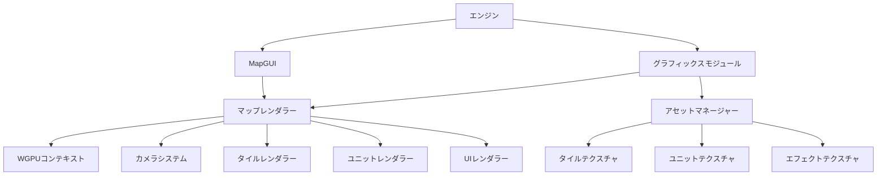

# グラフィカルマップ実装計画

## 1. 概要

現在のASCII表示から2Dピクセルアートスタイルのグラフィカルマップ表示に移行するための実装計画です。WGPUを活用して高速なレンダリングを実現し、将来的にはアニメーション、天候効果、戦闘エフェクトなどの視覚効果もサポートします。

## 2. アーキテクチャ設計



## 3. コンポーネント詳細

### 3.1 グラフィックスモジュール

グラフィックス関連の機能を集約するモジュールです。

```rust
// engine/src/graphics/mod.rs
pub mod renderer;
pub mod assets;
pub mod camera;
pub mod shaders;
pub mod texture;
pub mod window;
```

### 3.2 WGPUコンテキスト

WGPUの初期化と管理を担当します。

```rust
// engine/src/graphics/wgpu_context.rs
pub struct WgpuContext {
    pub device: wgpu::Device,
    pub queue: wgpu::Queue,
    pub surface: wgpu::Surface,
    pub surface_config: wgpu::SurfaceConfiguration,
    pub render_pipeline: wgpu::RenderPipeline,
    // ...
}

impl WgpuContext {
    pub fn new(window: &winit::window::Window) -> Self { /* ... */ }
    pub fn resize(&mut self, new_size: winit::dpi::PhysicalSize<u32>) { /* ... */ }
    pub fn prepare_frame(&self) -> wgpu::SurfaceTexture { /* ... */ }
    pub fn submit_commands(&self, command_buffer: wgpu::CommandBuffer) { /* ... */ }
    // ...
}
```

### 3.3 アセットマネージャー

テクスチャや他のゲームアセットを管理します。

```rust
// engine/src/graphics/assets/mod.rs
pub struct AssetManager {
    textures: HashMap<TextureId, Texture>,
    texture_atlases: HashMap<AtlasId, TextureAtlas>,
    // ...
}

impl AssetManager {
    pub fn new(device: &wgpu::Device, queue: &wgpu::Queue) -> Self { /* ... */ }
    pub fn load_texture(&mut self, id: TextureId, path: &str) -> Result<()> { /* ... */ }
    pub fn create_atlas(&mut self, id: AtlasId, texture_id: TextureId, tile_size: (u32, u32)) -> Result<()> { /* ... */ }
    pub fn get_texture(&self, id: TextureId) -> Option<&Texture> { /* ... */ }
    pub fn get_atlas(&self, id: AtlasId) -> Option<&TextureAtlas> { /* ... */ }
    // ...
}
```

### 3.4 カメラシステム

マップのビューを管理し、スクロールやズーム機能を実装します。

```rust
// engine/src/graphics/camera.rs
pub struct Camera {
    pub position: Vec2,
    pub zoom: f32,
    pub rotation: f32,
    // ...
}

impl Camera {
    pub fn new() -> Self { /* ... */ }
    pub fn view_matrix(&self) -> Mat4 { /* ... */ }
    pub fn projection_matrix(&self, aspect_ratio: f32) -> Mat4 { /* ... */ }
    pub fn scroll(&mut self, delta_x: f32, delta_y: f32) { /* ... */ }
    pub fn zoom(&mut self, factor: f32) { /* ... */ }
    pub fn screen_to_world(&self, screen_pos: Vec2, screen_size: Vec2) -> Vec2 { /* ... */ }
    pub fn world_to_screen(&self, world_pos: Vec2, screen_size: Vec2) -> Vec2 { /* ... */ }
    // ...
}
```

### 3.5 マップレンダラー

マップとユニットのレンダリングを担当します。

```rust
// engine/src/graphics/renderer/map_renderer.rs
pub struct MapRenderer {
    wgpu_context: WgpuContext,
    camera: Camera,
    asset_manager: AssetManager,
    tile_renderer: TileRenderer,
    unit_renderer: UnitRenderer,
    ui_renderer: UIRenderer,
    // ...
}

impl MapRenderer {
    pub fn new(window: &Window) -> Self { /* ... */ }
    pub fn render(&mut self, map: &Map, units: &HashMap<u32, Unit>, options: &MapViewOptions) -> Result<()> { /* ... */ }
    pub fn update_viewport(&mut self, width: u32, height: u32) { /* ... */ }
    pub fn handle_input(&mut self, event: &WindowEvent) -> bool { /* ... */ }
    // ...
}
```

### 3.6 シェーダーシステム

WGSLシェーダーを管理します。

```wgsl
// engine/src/graphics/shaders/tile.wgsl
struct VertexInput {
    @location(0) position: vec3<f32>,
    @location(1) tex_coords: vec2<f32>,
};

struct VertexOutput {
    @builtin(position) clip_position: vec4<f32>,
    @location(0) tex_coords: vec2<f32>,
};

@vertex
fn vs_main(in: VertexInput) -> VertexOutput {
    var out: VertexOutput;
    out.clip_position = vec4<f32>(in.position, 1.0);
    out.tex_coords = in.tex_coords;
    return out;
}

@fragment
fn fs_main(in: VertexOutput) -> @location(0) vec4<f32> {
    return textureSample(t_diffuse, s_diffuse, in.tex_coords);
}
```

## 4. MapGUIとの統合オプション

### オプション1: 描画方法の切り替え機能

```rust
// engine/src/gui/map_gui.rs
pub enum RenderMode {
    Ascii,
    Graphical,
}

pub struct MapGUI {
    // 既存のフィールド
    render_mode: RenderMode,
    map_renderer: Option<MapRenderer>,
    // ...
}

impl MapGUI {
    // 既存のメソッド
    
    pub fn set_render_mode(&mut self, mode: RenderMode) {
        self.render_mode = mode;
        if mode == RenderMode::Graphical && self.map_renderer.is_none() {
            self.map_renderer = Some(MapRenderer::new());
        }
        self.publish_map_updated().ok();
    }
    
    pub fn render(&self) {
        match self.render_mode {
            RenderMode::Ascii => self.print_ascii_map(),
            RenderMode::Graphical => {
                if let Some(renderer) = &self.map_renderer {
                    renderer.render(self.map.as_ref().unwrap(), &self.units, &self.view_options).unwrap();
                }
            }
        }
    }
    // ...
}
```

### オプション2: 描画ストラテジーパターン

```rust
// engine/src/gui/map_gui.rs
pub trait MapRenderer {
    fn render(&self, map: &Map, units: &HashMap<u32, Unit>, options: &MapViewOptions) -> Result<()>;
    fn handle_input(&mut self, event: &WindowEvent) -> bool;
    fn update_viewport(&mut self, width: u32, height: u32);
}

pub struct AsciiRenderer;
impl MapRenderer for AsciiRenderer {
    // ASCIIレンダリングの実装
}

pub struct GraphicalRenderer {
    // グラフィカルレンダリングの実装
}
impl MapRenderer for GraphicalRenderer {
    // グラフィカルレンダリングの実装
}

pub struct MapGUI {
    // 既存のフィールド
    renderer: Box<dyn MapRenderer>,
    // ...
}

impl MapGUI {
    // 既存のメソッド
    
    pub fn set_renderer(&mut self, renderer: Box<dyn MapRenderer>) {
        self.renderer = renderer;
        self.publish_map_updated().ok();
    }
    
    pub fn render(&self) {
        self.renderer.render(self.map.as_ref().unwrap(), &self.units, &self.view_options).unwrap();
    }
    // ...
}
```

### オプション3: ハイブリッドアプローチ（推奨）

```rust
// engine/src/gui/map_gui.rs
pub struct MapGUI {
    // 既存のフィールド
    graphical_renderer: Option<GraphicalMapRenderer>,
    use_graphical: bool,
    // ...
}

impl MapGUI {
    // 既存のメソッド
    
    pub fn enable_graphical_rendering(&mut self, window: &Window) -> Result<()> {
        if self.graphical_renderer.is_none() {
            self.graphical_renderer = Some(GraphicalMapRenderer::new(window)?);
        }
        self.use_graphical = true;
        self.publish_map_updated()?;
        Ok(())
    }
    
    pub fn disable_graphical_rendering(&mut self) {
        self.use_graphical = false;
        self.publish_map_updated().ok();
    }
    
    pub fn render(&self) {
        if self.use_graphical {
            if let Some(renderer) = &self.graphical_renderer {
                renderer.render(self.map.as_ref().unwrap(), &self.units, &self.view_options).unwrap();
            }
        } else {
            self.print_ascii_map();
        }
    }
    
    // 既存のASCIIレンダリングメソッドは維持
    // ...
}
```

## 5. 実装ステップ

### フェーズ1: 環境設定

1. wgpu、winit、およびその他の必要なグラフィックス依存関係の追加
2. グラフィックスモジュールの基本構造の実装
3. 基本的なWGPUコンテキストの実装
4. シンプルなウィンドウ表示のサンプル作成

### フェーズ2: 基本タイルレンダリング

1. タイルテクスチャの読み込みとアセット管理システムの実装
2. 基本的なタイルレンダリングシステムの実装
3. カメラシステムの実装（スクロール、ズーム）
4. MapGUIとの基本的な統合

### フェーズ3: 高度な機能

1. ユニットレンダリングシステムの実装
2. 選択とハイライト表示の視覚効果
3. シンプルなアニメーション効果（移動、攻撃など）
4. UIオーバーレイの実装（ミニマップ、情報パネルなど）

### フェーズ4: 最適化と拡張

1. レンダリングパフォーマンスの最適化
2. 天候効果と環境エフェクトの追加
3. 戦闘エフェクトの実装
4. 拡張可能なエフェクトシステムの構築

## 6. 依存関係の追加

```toml
# engine/Cargo.toml の依存関係に追加
[dependencies]
# 既存の依存関係
crossbeam-channel = "0.5"
anyhow = "1.0"
log = "0.4"
model = { path = "../model" }

# グラフィックス関連の依存関係
wgpu = "0.17"
winit = "0.28"
bytemuck = { version = "1.13", features = ["derive"] }
image = "0.24"
glam = "0.24"  # ベクトル/行列計算用
futures-intrusive = "0.5"  # 非同期処理用
```

## 7. タイルセットの仕様

各地形タイプに対応するピクセルアートタイルを作成または入手する必要があります。仕様は以下の通りです：

- タイルサイズ: 32x32ピクセル（基本）
- カラーパレット: 各地形タイプに適した色
- ファイル形式: PNG（透過対応）
- タイルセット構成:
  - 平地（Plain）
  - 森（Forest）
  - 山（Mountain）
  - 水域（Water）
  - 道路（Road）
  - 都市（City）
  - 拠点（Base）

各タイルは静止状態とアニメーション状態の両方をサポートします。

## 8. ユニット表現

各ユニットタイプとその勢力に対応するスプライトを作成します：

- ユニットスプライトサイズ: 32x32ピクセル
- 各勢力ごとに色分け
- ユニットタイプごとに異なるデザイン:
  - 歩兵（Infantry）
  - 騎兵（Cavalry）
  - 射手（Ranged）
  - 攻城（Siege）
  - 支援（Support）

## 9. 今後の展望

- エフェクトシステムの強化
- 昼夜サイクルの実装
- 季節変化の視覚表現
- レイヤーベースのマップ表示（高度表現など）
- パーティクルシステムによる環境効果
- シェーダーエフェクトの拡張

## 10. 技術的な課題と解決策

1. **パフォーマンス最適化**:
   - インスタンシングを使用して多数のタイルを効率的に描画
   - カリング技術で視界外のタイルの描画を回避

2. **メモリ管理**:
   - テクスチャアトラスを使用してGPUメモリ使用量を削減
   - 必要に応じたアセットの動的読み込み

3. **プラットフォーム互換性**:
   - WGPUの抽象化を活用してクロスプラットフォーム対応を確保
   - 適切なフォールバックメカニズムを実装

4. **拡張性**:
   - モジュール式の設計で将来的な機能追加を容易に
   - プラグインシステムによるカスタムエフェクトのサポート