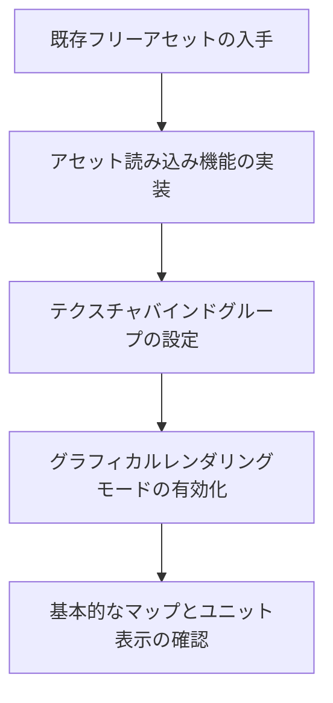
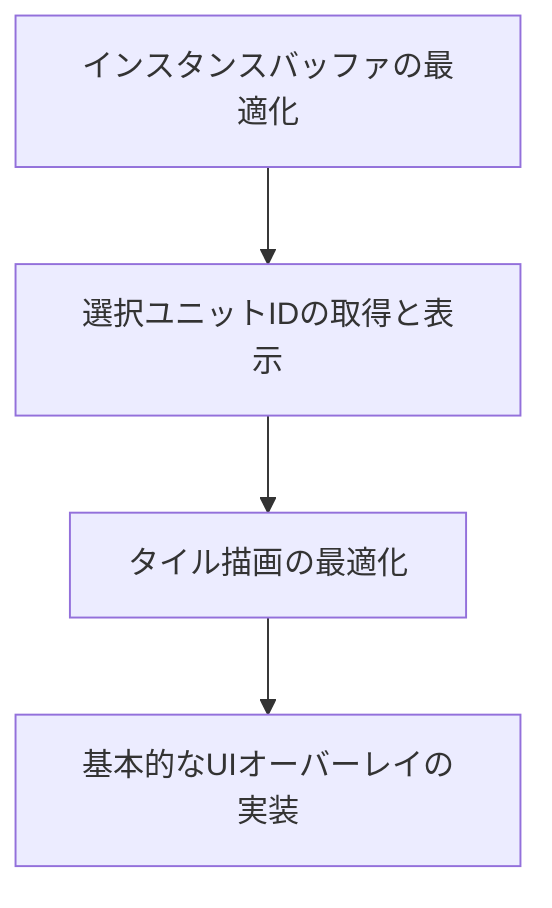
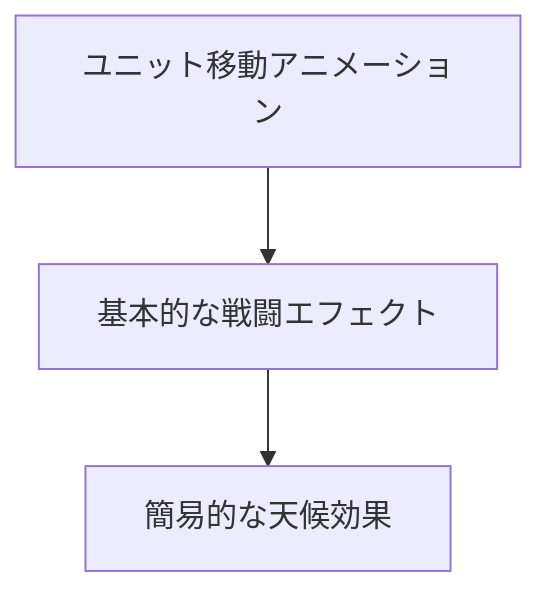

# グラフィカルマップレンダリング実装計画 (フェーズ2)

## 1. 概要

現在のASCII表示からグラフィカルマップ表示への移行を完成させるための実装計画です。基盤部分（WGPUコンテキスト、カメラシステム、テクスチャ管理、シェーダー、レンダリングパイプライン）は既に実装済みであり、この計画では残りの機能を段階的に実装していきます。

## 2. 実装フェーズ

### フェーズ1: 基本的なグラフィカルレンダリングの実現（優先度: 高）

1. **既存フリーアセットの入手と統合**
   - オープンソースのタイルセット（例: OpenGameArt, Kenney.nlなど）から適切なものを選定
   - 32x32ピクセルのタイルセットを優先（仕様書に合わせて）
   - 7種類のセルタイプ（平地、森、山、水域、道路、都市、拠点）をカバーするもの
   - 同様に、ユニットスプライトも入手（歩兵、騎兵、射手、攻城、支援）

2. **アセット読み込み機能の実装**
   - `initialize_assets`関数の完成
   - アセットのパスを設定ファイルから読み込むか、環境に応じて適切に設定
   - `AssetManager`の`load_default_tileset`と`load_default_unitset`メソッドの呼び出し

3. **テクスチャバインドグループの設定**
   - タイルレンダラーとユニットレンダラーでテクスチャバインドグループを設定
   - コメントアウトされている部分（`render_pass.set_bind_group(1, texture_bind_group, &[]);`）の実装

4. **グラフィカルレンダリングモードの有効化**
   - `graphical_map_demo.rs`の`enable_graphical_rendering`メソッド呼び出しのコメントを解除
   - 必要に応じてasync/await処理の調整

### フェーズ2: レンダリングの最適化と機能拡張（優先度: 中）

1. **インスタンスバッファの更新の最適化**
   - インスタンスデータが変更された場合にのみバッファを更新するよう改善
   - GPUメモリ使用量の削減

2. **選択されたユニットIDの取得と表示**
   - MapGUIから選択されたユニットIDを取得する機能の実装
   - 選択されたユニットの視覚的なハイライト表示

3. **タイル描画の最適化**
   - インスタンシング技術の活用
   - 視界外のタイルのカリング処理

4. **基本的なUIオーバーレイの実装**
   - シンプルなミニマップの表示
   - 基本的な情報パネルの実装

### フェーズ3: 視覚効果とアニメーションの追加（優先度: 低）

1. **ユニット移動アニメーションの実装**
   - 移動パスに沿ったスムーズなアニメーション
   - 移動速度の調整機能

2. **基本的な戦闘エフェクトの実装**
   - 攻撃と防御のシンプルな視覚効果
   - ダメージ表示

3. **簡易的な天候効果の実装**
   - 基本的な天候状態（晴れ、雨、雪など）の視覚表現
   - 天候による視覚的な変化

## 3. 実装上の注意点

1. **アセット管理**
   - アセットのライセンスを確認し、適切に帰属表示
   - アセットのパスを相対パスで指定し、異なる環境でも動作するよう配慮
   - アセットの動的読み込みを考慮（必要に応じて）

2. **パフォーマンス**
   - 大きなマップでもスムーズに動作するよう最適化
   - インスタンシングとカリングの適切な実装
   - メモリ使用量の監視と最適化

3. **クロスプラットフォーム対応**
   - WGPUの抽象化を活用して異なるプラットフォームでも動作するよう配慮
   - 適切なフォールバックメカニズムの実装

4. **拡張性**
   - 将来的なカスタムアセット対応を見据えたモジュール設計
   - アセット切り替えが容易な構造

## 4. 必要な追加情報

1. アセットの保存場所とロード方法の詳細設計
2. テクスチャアトラスの正確なUV座標マッピング
3. インスタンスバッファの更新戦略の詳細
4. 選択されたユニットの視覚的表現の仕様

## 5. 実装スケジュール

| フェーズ | タスク | 予定期間 |
|---------|-------|---------|
| 1 | 既存フリーアセットの入手と統合 | 2日 |
| 1 | アセット読み込み機能の実装 | 2日 |
| 1 | テクスチャバインドグループの設定 | 1日 |
| 1 | グラフィカルレンダリングモードの有効化 | 1日 |
| 2 | インスタンスバッファの更新の最適化 | 2日 |
| 2 | 選択されたユニットIDの取得と表示 | 1日 |
| 2 | タイル描画の最適化 | 2日 |
| 2 | 基本的なUIオーバーレイの実装 | 3日 |
| 3 | ユニット移動アニメーションの実装 | 3日 |
| 3 | 基本的な戦闘エフェクトの実装 | 3日 |
| 3 | 簡易的な天候効果の実装 | 2日 |

## 6. 参考リソース

- フリータイルセット: [OpenGameArt](https://opengameart.org/), [Kenney.nl](https://kenney.nl/)
- WGPU ドキュメント: [wgpu-rs](https://wgpu.rs/)
- テクスチャアトラス関連: [TextureAtlas in game engines](https://gameprogrammingpatterns.com/sprite-sheet.html)
- インスタンシング技術: [WGPU Instancing Example](https://github.com/gfx-rs/wgpu/tree/master/examples/src/instancing)